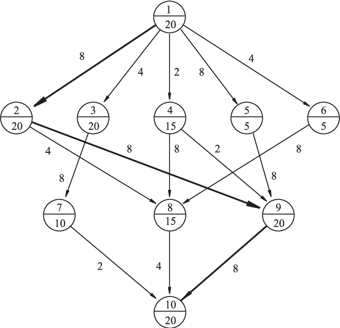
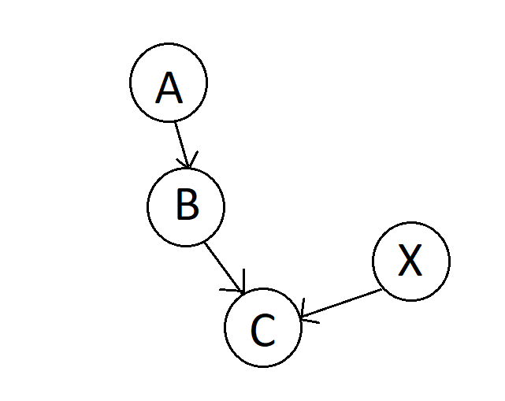
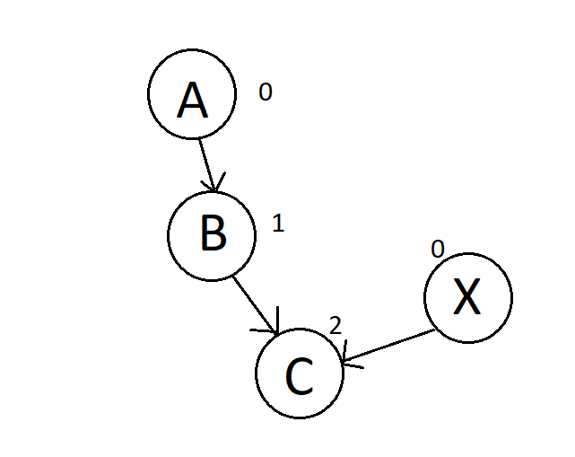

<!--
*** AmeenDarwish, Graph-implementation, twitter_handle, email, Elusive leveled DAG, project_description
-->


 

<br />


<p align="center">
  <a href="https://github.com/AmeenDarwish/Graph-implementation">
    
  </a>

   <h3 align="center">Elusive leveled DAG</h3>

  <p align="center">
    An implementation of a Directed Acyclic Graph in Python (3.8).
    The implementation includes levels,Cycle Checks,traversal,weights and a separated class for vertices and edges
    <br />
    <a href="https://github.com/AmeenDarwish/Graph-implementation">Report Bug</a>
    <a href="https://github.com/AmeenDarwish/Graph-implementation">Request Feature</a>
  </p>


<!-- TABLE OF CONTENTS -->
<details open="open">
  <summary><h2 style="display: inline-block">Table of Contents</h2></summary>
  <ol>
    <li>
      <a href="#about-the-project">About The Project</a>
    </li>
    <li>
      <a href="#getting-started">Getting Started</a>
      <ul>
        <li><a href="#prerequisites">Prerequisites</a></li>
        <li><a href="#installation">Installation</a></li>
      </ul>
    </li>
    <li><a href="#usage">Usage</a></li>
    <li><a href="#roadmap">Roadmap</a></li>
  </ol>
</details>


<!-- ABOUT THE PROJECT -->
## About The Project


The project is a modest implementation of a directed acyclic graph in python.
The project includes almost no dependencies other than python's random and unit testing libraries for validation
Main features include 
I was asked to implement a DAG data structure that 

* Holds the outer *and* inner connections for each vertex
* Built in path traversal and path finding algorithms 
* Built in cyclic and connection validation
* Independent classes for Edges and vertices for simpler implementation
* Extended use of python's class methods for easier user experience
* Use of level as a vertex property for better understanding of graph
* Built in support for weights in edges and labels in vertices


<!-- GETTING STARTED -->
## Getting Started

To get a local copy up and running follow these simple steps.

### Prerequisites

This is an example of how to list things you need to use the software and how to install them.
* npm
  ```sh
  npm install npm@latest -g
  ```

### Installation

1. Clone the repo
   ```sh
   git clone https://github.com/AmeenDarwish/Graph-implementation.git
   ```
2. Install NPM packages
   ```sh
   npm install
   ```


<!-- USAGE EXAMPLES -->
## Usage
<h3 align="center">Simple use</h3>
To create a simple Graph , simply call constructor and use the add_edges method to add any two edges.
The format is edge(source,target,weight(optional))
The vertices in each edge can be of any type that supports hashing and equality comparisons 
```sh
    #init
    graph = Graph()
    #adding edges
    graph.add_edge("A", "B") 
    graph.add_edge("B", "C")
    graph.add_edge("X", "C")
```
This will result in getting the following graph:



The same result can be achieved through different use:
```sh
    #init
    graph = Graph()
    #add vertices
    graph.add_vertex("A")
    graph.add_vertex("B")
    graph.add_vertex("C")
    graph.add_vertex("X")
    #later decide to connect graph
    graph.add_edge("A", "B") 
    graph.add_edge("B", "C")
    graph.add_edge("X", "C")
```
And if you want to see if the graph above is connected simply use:
```sh
    #should return True
    graph.is_connected()
```
<h3 align="center">Levels</h3>

One of the main properties of this graph is the capability of assigning each vertex a level.

level denotes how far vertex is from source, source being at level = 0 and nodes connected at level=1 , nodes connected
to them are of level = 2 and so on,if you want the graph to set levels you have to call get_level(key) on any key
within you're graph.
To get the level of any node:
```sh
    graph.get_level(key)
```
if we print every vertex afterwards , each vertex will be represented with it's key and level.
To get an intuition , the last graph with levels would look like this:



Notice that here X is a node with no edges pointing towards it , making it a source with a level zero
We define a source and a sink:
    sources are vertices that have no edges pointing to them.(vertex.in_edges = 0)
    sinks are vertices that have no edges pointing out of them.(vertex.out_edges = 0)

You can get all nodes at a certain level by using:
```sh
    graph.get_vertices_at_level(level)
```
You can get all sources using:
```sh
    graph.get_sources()
```
You can get all sinks using:
```sh
    graph.get_sinks()
```

<!-- Design -->
## Design

<!-- ROADMAP -->
## Roadmap


provided time; The following features would make the graph a much better tool:
                 
* Method to connect one vertex to another without having to use edge 
```sh
    def connect_vertex(key1,key2)
``` 
  would create edge within implementation making the graph much simpler to use 

* Method to disconnect , instead of removing entire vertices and recreating edges,method would just unlink two vertices
```sh
    def connect_vertex(key1,key2)
``` 
* is_cyclic method was never implemented due to time and test costs;
  it's the users responsibility, but it shouldn't be

* Continuing design plan to privatize and simplify the use of the class ,effectively making Edge and Vertex private
  inner classes of Graph class to hide implementation and insure correct use through
  design principles such as facade and single responsibility 


<!-- CONTRIBUTING -->
## Contributing

Any one is welcome to play with the code and open a pull request and if you do, make it interesting

1. Fork the Project
2. Create your Feature Branch (`git checkout -b feature/AmazingFeature`)
3. Commit your Changes (`git commit -m 'Add some AmazingFeature'`)
4. Push to the Branch (`git push origin feature/AmazingFeature`)
5. Open a Pull Request


<!-- CONTACT -->
## Contact

Ameen Darwish-AmeenDarwish@mail.huji.ac.il

Project Link: [https://github.com/AmeenDarwish/Graph-implementation](https://github.com/AmeenDarwish/Graph-implementation)


<!-- MARKDOWN LINKS & IMAGES -->
<!-- https://www.markdownguide.org/basic-syntax/#reference-style-links -->
[contributors-shield]: https://img.shields.io/github/contributors/AmeenDarwish/repo.svg?style=for-the-badge
[contributors-url]: https://github.com/AmeenDarwish/repo/graphs/contributors
[forks-shield]: https://img.shields.io/github/forks/AmeenDarwish/repo.svg?style=for-the-badge
[forks-url]: https://github.com/AmeenDarwish/repo/network/members
[stars-shield]: https://img.shields.io/github/stars/AmeenDarwish/repo.svg?style=for-the-badge
[stars-url]: https://github.com/AmeenDarwish/repo/stargazers
[issues-shield]: https://img.shields.io/github/issues/AmeenDarwish/repo.svg?style=for-the-badge
[issues-url]: https://github.com/AmeenDarwish/repo/issues
[license-shield]: https://img.shields.io/github/license/AmeenDarwish/repo.svg?style=for-the-badge
[license-url]: https://github.com/AmeenDarwish/repo/blob/master/LICENSE.txt
[linkedin-shield]: https://img.shields.io/badge/-LinkedIn-black.svg?style=for-the-badge&logo=linkedin&colorB=555
[linkedin-url]: https://linkedin.com/in/AmeenDarwish
